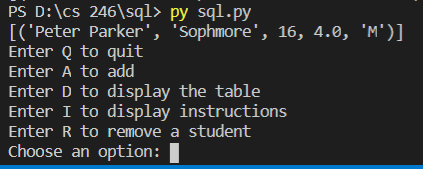

## Overview
This program is used to access a practice data base that requires no key and only has one table. This is to show my knowledge of using both python and sql together to maniqulate databases.

### Enviorment:
I used visual studio code with python and git downloaded. I also added the mysql-connector-python. I also used XAMPP to access and create the data base.

##### Running the Program:
I simpy inputed "python sql.py" into the terminal and it displayed the results.

##### Screenshot:

##### Helpful Websites: 
https://www.w3schools.com/python/python_mysql_getstarted.asp
https://dev.mysql.com/doc/refman/8.0/en/database-use.html
